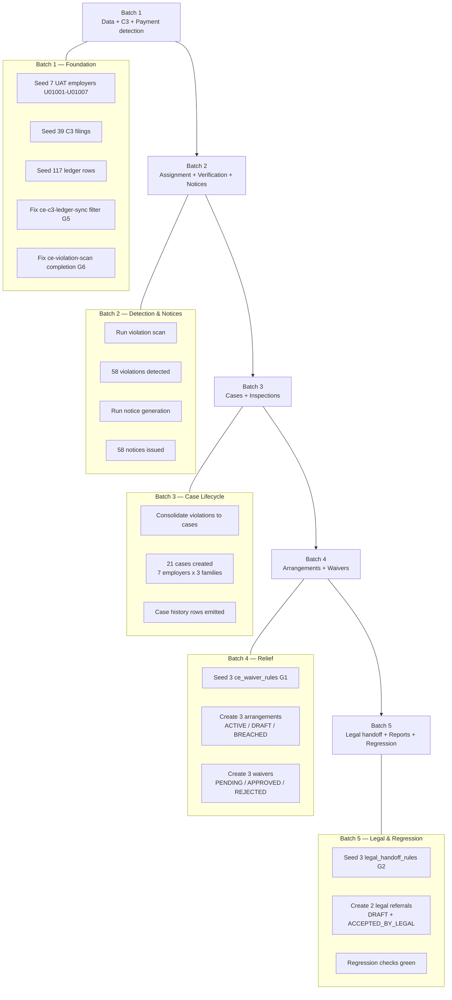
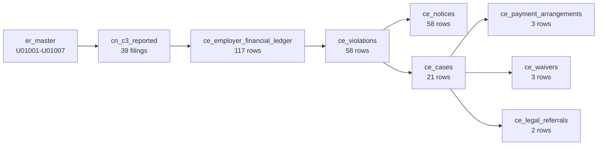

# Compliance E2E Remediation — UAT End-to-End Flow Guide

**Version:** 1.0  
**Date:** 2026-07-15  
**Audience:** UAT testers performing manual acceptance of Batches 1–5.  
**Companion reports:** `BATCH_2_EXECUTION_REPORT.md`, `BATCH_3_EXECUTION_REPORT.md`, `BATCH_4_EXECUTION_REPORT.md`, `BATCH_5_EXECUTION_REPORT.md`, and the gap register at `docs/compliance/compliance_end_to_end_gap_register.md`.

---

## 1. Purpose

This document consolidates the **exact flow** used to remediate the Compliance E2E gaps across Batches 1–5, the **test data** seeded, and the **manual acceptance criteria** each tester must confirm before sign-off.

Use it as the single walk-through when validating the fixes end-to-end. Each section below can be executed independently, but the recommended sequence follows the enforcement lifecycle.

---

## 2. End-to-End Flow (Mermaid)



### Data lineage per employer



---

## 3. Test Data Reference

### 3.1 UAT employer slice (Batch 1)

| Reg No  | Purpose |
|---------|---------|
| U01001  | Baseline compliant → non-payment scenario |
| U01002  | Late filing + partial payment |
| U01003  | Repeat defaulter (drives breach + legal) |
| U01004  | Late filing only |
| U01005  | Non-filing |
| U01006  | Employee discrepancy |
| U01007  | Small employer edge cases |

All markers seeded with `created_by = 'UAT_B1'` (later batches use `UAT_B2` … `UAT_B5`).

### 3.2 Volume summary after all batches

| Table                          | Rows (U010% slice) |
|--------------------------------|:------------------:|
| `er_master`                    | 7                  |
| `cn_c3_reported`               | 39                 |
| `ce_employer_financial_ledger` | 117                |
| `ce_violations`                | 58                 |
| `ce_notices`                   | 58                 |
| `ce_cases`                     | 21                 |
| `ce_payment_arrangements`      | 3                  |
| `ce_waivers`                   | 3                  |
| `ce_waiver_rules`              | 3                  |
| `ce_legal_handoff_rules`       | 3                  |
| `ce_legal_referrals`           | 2                  |

### 3.3 Key identifiers testers will filter on

- Employer filter: `regno LIKE 'U010%'`
- Batch tag: `created_by IN ('UAT_B1','UAT_B2','UAT_B3','UAT_B4','UAT_B5')`
- Case numbers: `CC-2026-*` (21 cases)
- Arrangement numbers: `PA-UAT-2026-0001..0003`
- Waiver numbers: `WV-UAT-2026-0001..0003`
- Legal referral numbers: `CE-LR-2026-0001..0002`

---

## 4. Batch-by-Batch Manual Acceptance

Each subsection below is self-contained. Complete them in order the first time; re-run individually thereafter.

---

### 4.1 Batch 1 — Data + C3 + Payment detection

**Objective:** Confirm the foundation dataset exists and that ledger sync (**G5**) and violation scan (**G6**) run to completion.

**Steps to reproduce:**

1. Log in as a Compliance Admin.
2. Open **Compliance → Employers** and filter by regno `U010%`. Expect **7** rows.
3. Open **Compliance → C3 Filings** and filter by same. Expect **39** rows across the 3 recent periods.
4. Open **Compliance → Automation Jobs** and locate `ce-c3-ledger-sync`. Trigger a manual run.
5. Locate `ce-violation-scan` and trigger a manual run.

**Verification SQL:**
```sql
SELECT count(*) FROM er_master WHERE regno LIKE 'U010%';                    -- 7
SELECT count(*) FROM cn_c3_reported WHERE regno LIKE 'U010%';               -- 39
SELECT count(*) FROM ce_employer_financial_ledger WHERE employer_id LIKE 'U010%'; -- 117
SELECT status, count(*) FROM ce_automation_runs
 WHERE job_code IN ('ce-c3-ledger-sync','ce-violation-scan')
 GROUP BY status;                                                            -- no stranded 'Running'
```

**Acceptance criteria:**

- [ ] 7 UAT employers visible, all `active`.
- [ ] 39 C3 filings visible.
- [ ] 117 ledger rows visible.
- [ ] `ce-c3-ledger-sync` completes with `processed_count > 0` (fixes **G5**).
- [ ] `ce-violation-scan` completes with `status = 'Completed'` (fixes **G6**).
- [ ] No runs left stranded in `Running` for > 5 minutes.

**Definition of Done:** All checkboxes above tick and no critical errors appear in Edge Function logs.

---

### 4.2 Batch 2 — Assignment + Verification + Notices

**Objective:** Confirm 58 violations were detected and 58 notices generated with correct payloads.

**Steps to reproduce:**

1. Go to **Compliance → Violations**, filter employer `U010%`. Expect **58** rows.
2. Open a LATE_FILING violation for `U01004` — confirm status = `OPEN`, priority set, `case_id` populated (after Batch 3 runs).
3. Go to **Compliance → Notices**, filter same. Expect **58** notices with `status = 'ISSUED'`.
4. Open one notice — verify letterhead, employer address, violation number and period render correctly.
5. Trigger `run-notice-generation` again — confirm idempotent (does not duplicate).

**Verification SQL:**
```sql
SELECT violation_type, count(*) FROM ce_violations
 WHERE employer_id LIKE 'U010%' GROUP BY violation_type;   -- 58 total
SELECT count(*) FROM ce_notices WHERE employer_id LIKE 'U010%'; -- 58
```

**Acceptance criteria:**

- [ ] 58 violations across expected types (LATE_FILING dominant, plus PAYMENT + DECLARATION).
- [ ] 58 notices generated, 1 per violation.
- [ ] Notice PDF renders without missing tokens.
- [ ] Re-running notice generation does **not** create duplicates.

**Definition of Done:** All checkboxes tick and testers can download at least one PDF notice per employer without error.

---

### 4.3 Batch 3 — Case Lifecycle Consolidation

**Objective:** Confirm the 58 violations were consolidated into **21 cases** (7 employers × 3 case families: FILING / PAYMENT / DECLARATION) and the case history is written.

**Steps to reproduce:**

1. Go to **Compliance → Cases**, filter by case number `CC-2026-%` and employer `U010%`. Expect **21** cases.
2. Open FILING case for `U01007` — expect **8** child violations rendered on the Violations tab.
3. On any case, exercise Assign officer → confirm `ce_case_history` receives `ASSIGNED` row.
4. Add a correspondence entry → confirm history logs `CORRESPONDENCE_ADDED`.
5. Change case status DRAFT → OPEN → IN_REVIEW → confirm each transition writes to `ce_case_history`.

**Verification SQL:**
```sql
SELECT employer_id, case_family, count(*)
FROM ce_cases WHERE employer_id LIKE 'U010%'
GROUP BY employer_id, case_family ORDER BY employer_id;

SELECT count(*) FROM ce_violations
 WHERE employer_id LIKE 'U010%' AND case_id IS NULL;   -- 0

SELECT count(*) FROM ce_case_history h
 JOIN ce_cases c ON c.id = h.case_id
 WHERE c.employer_id LIKE 'U010%' AND h.event_type = 'CASE_CREATED';  -- 21
```

**Acceptance criteria:**

- [ ] 21 cases visible; 7 employers × 3 families.
- [ ] 0 unlinked violations for U010% slice.
- [ ] 21 `CASE_CREATED` history rows exist.
- [ ] Assign / correspondence / status changes all emit history rows via `fn_ce_case_status_change_trigger`.

**Definition of Done:** Every UI action on a case that mutates state produces a corresponding `ce_case_history` row.

**Known gaps to note (do not block sign-off):** G16 (consolidation not auto-invoked), G17 (empty `ce_case_notices` join), G18 (all cases defaulted to LOW priority).

---

### 4.4 Batch 4 — Arrangements + Waivers

**Objective:** Verify the 3 arrangement lifecycle states, the 3 waiver lifecycle states, and the newly seeded waiver rules (**G1 fix**).

**Test data:**

| Object            | ID / Number          | Employer | State     |
|-------------------|----------------------|----------|-----------|
| Arrangement       | `PA-UAT-2026-0001`   | U01001   | ACTIVE    |
| Arrangement       | `PA-UAT-2026-0002`   | U01002   | DRAFT     |
| Arrangement       | `PA-UAT-2026-0003`   | U01003   | BREACHED  |
| Waiver            | `WV-UAT-2026-0001`   | U01001   | PENDING   |
| Waiver            | `WV-UAT-2026-0002`   | U01002   | APPROVED  |
| Waiver            | `WV-UAT-2026-0003`   | U01003   | REJECTED  |
| Waiver rule       | `WR-PENALTY-PARTIAL` | —        | enabled   |
| Waiver rule       | `WR-INTEREST-FULL`   | —        | enabled   |
| Waiver rule       | `WR-FEE-DISCRETION`  | —        | enabled   |

**Steps to reproduce:**

1. **Waiver rules** — Go to **Compliance → Admin → Waiver Rules** *(or query if UI absent — G19)*. Confirm 3 rules visible and `enabled = true`.
2. **Arrangements**
   - Open **PA-UAT-2026-0002** (DRAFT) → Approve → Sign → Activate. Confirm `approved_at`, `signed_at` are set.
   - Open **PA-UAT-2026-0003** (BREACHED) → verify breach banner + `missed_payments = 3`.
3. **Waivers**
   - Open **WV-UAT-2026-0001** (PENDING) → reviewer decision → approver decision → apply. Confirm `applied_at` populates.
   - Open **WV-UAT-2026-0002** (APPROVED) → reviewer + approver comments visible.
   - Open **WV-UAT-2026-0003** (REJECTED) → `rejected_reason` visible.

**Verification SQL:** see `BATCH_4_EXECUTION_REPORT.md` §3.

**Acceptance criteria:**

- [ ] 3 waiver rules seeded and enabled (G1 closed).
- [ ] Arrangement statuses ACTIVE / DRAFT / BREACHED all present.
- [ ] Draft arrangement transitions all the way to ACTIVE without error.
- [ ] Waiver statuses PENDING / APPROVED / REJECTED all present.
- [ ] Pending waiver flows to APPLIED with reviewer + approver actions.

**Definition of Done:** All 6 UAT records reach a terminal state without manual DB edits.

**Known gaps to note:** G19 (no waiver-rule admin UI), G20 (breach engine does not auto-insert `ce_arrangement_breaches`), G21 (approved waiver not posted to ledger).

---

### 4.5 Batch 5 — Legal Handoff + Reports + Regression

**Objective:** Verify legal handoff rules (**G2 fix**), the 2 UAT legal referrals, and overall regression.

**Test data:**

| Object                | Code / Number          | State                |
|-----------------------|------------------------|----------------------|
| Handoff rule          | `LHR-STANDARD`         | enabled              |
| Handoff rule          | `LHR-BREACH-FAST`      | enabled              |
| Handoff rule          | `LHR-REPEAT-DEFAULTER` | enabled              |
| Legal referral        | `CE-LR-2026-0001`      | DRAFT (U01003)       |
| Legal referral        | `CE-LR-2026-0002`      | ACCEPTED_BY_LEGAL (U01007) |

**Steps to reproduce:**

1. Open **Compliance → Admin → Legal Handoff Rules** — confirm 3 rules enabled.
2. Open **Compliance → Legal Referrals** filter `CE-LR-2026-%` — confirm 2 rows.
3. Open **CE-LR-2026-0001** → advance from DRAFT → PENDING_REVIEW → APPROVED → ACCEPTED_BY_LEGAL. Confirm each transition is timestamped.
4. Open **CE-LR-2026-0002** → confirm `accepted_at` set and cross-links `lg_intake_id` / `lg_case_no` (may be NULL — see G23).
5. Run the regression queries in `BATCH_5_EXECUTION_REPORT.md` §Regression.

**Verification SQL:**
```sql
SELECT code, enabled FROM ce_legal_handoff_rules ORDER BY code;
SELECT referral_number, employer_id, status, outstanding_amount
FROM ce_legal_referrals WHERE referral_number LIKE 'CE-LR-2026-%';
```

**Acceptance criteria:**

- [ ] 3 handoff rules seeded and enabled (G2 closed).
- [ ] 2 UAT referrals visible with correct status.
- [ ] Draft referral advances to ACCEPTED_BY_LEGAL.
- [ ] Regression totals match: 7 employers · 39 C3 · 117 ledger · 58 violations · 58 notices · 21 cases · 3 arrangements · 3 waivers · 2 referrals.

**Definition of Done:** All regression counts match and the two referrals are visible in both Compliance and Legal referral inboxes.

**Known gaps to note:** G22 (no auto-referral trigger), G23 (legal cross-link IDs not backfilled).

---

## 5. Gap Register Snapshot (Post-Remediation)

| Gap | Batch | Status  | Notes |
|-----|-------|---------|-------|
| G1  | 4     | Fixed   | 3 waiver rules seeded |
| G2  | 5     | Fixed   | 3 handoff rules seeded |
| G5  | 1     | Fixed   | Ledger sync filter corrected |
| G6  | 1     | Fixed   | Violation scan completion path fixed |
| G11 | 3     | Fixed   | Case consolidation function invoked |
| G12 | 3     | Fixed   | Case history trigger firing |
| G3, G7–G10, G16–G23 | — | Open | Deferred; documented in gap register |

Full details: `docs/compliance/compliance_end_to_end_gap_register.md`.

---

## 6. Sign-Off Template

Tester name: _______________________  
Date: _______________________  
Environment: _______________________

- [ ] Batch 1 accepted
- [ ] Batch 2 accepted
- [ ] Batch 3 accepted
- [ ] Batch 4 accepted
- [ ] Batch 5 accepted
- [ ] Deferred gaps (G3, G7–G10, G16–G23) acknowledged

Signature: _______________________

---

## 7. Rollback Notes

All UAT-seeded rows are tagged with `created_by IN ('UAT_B1'..'UAT_B5')`. To purge the UAT slice without touching production-like data:

```sql
DELETE FROM ce_legal_referrals    WHERE created_by LIKE 'UAT_B%';
DELETE FROM ce_waivers            WHERE created_by LIKE 'UAT_B%';
DELETE FROM ce_payment_arrangements WHERE created_by LIKE 'UAT_B%';
DELETE FROM ce_notices            WHERE created_by LIKE 'UAT_B%';
DELETE FROM ce_violations         WHERE created_by LIKE 'UAT_B%';
DELETE FROM ce_cases              WHERE created_by LIKE 'UAT_B%';
DELETE FROM ce_employer_financial_ledger WHERE created_by LIKE 'UAT_B%';
DELETE FROM cn_c3_reported        WHERE created_by LIKE 'UAT_B%';
DELETE FROM er_master             WHERE regno LIKE 'U010%';
-- Seeded rules (G1, G2) intentionally retained as they close configuration gaps.
```

Do **not** delete the seeded `ce_waiver_rules` or `ce_legal_handoff_rules` — those are the actual G1/G2 fixes.
