# Legal Platform — Business Capability Map

**Version:** 1.0  
**Status:** V1 certified (see `LEGAL_V1_CERTIFICATION_REPORT.md`).

---

## 1. Capability Hierarchy

```mermaid
graph TD
  LM[Legal Management]
  LM --> IQ[Intake & Qualification]
  LM --> MM[Matter Management]
  LM --> LIAB[Liability Management]
  LM --> CO[Court Operations]
  LM --> JO[Judicial Orders]
  LM --> AP[Appeals]
  LM --> EN[Enforcement]
  LM --> PJ[Post-Judgment Recovery]
  LM --> EC[External Counsel]
  LM --> CF[Court Filings]
  LM --> LCR[Legal Cost Recovery]
  LM --> RA[Reporting & Analytics]
  LM --> AD[Administration]
  LM --> MD[Master / Reference Data]
  LM --> SEC[Security]
  LM --> AUD[Audit]
```

---

## 2. Capability Catalog

### 2.1 Intake & Qualification
- **Purpose:** Convert compliance referrals into legal cases with checklist-driven qualification.
- **Screens:** `/legal/lg/intake`, `/legal/lg/referrals`, Intake Detail, Qualification Wizard.
- **Services:** `lgIntakeService`, `lgReferralService`, `lgChecklistService`.
- **Tables:** `lg_case_intake`, `lg_case_intake_source`, `lg_intake_checklist_template/response`, `lg_intake_info_request`, `lg_intake_decision_audit`, `ce_legal_referrals`.
- **Inputs:** Compliance referral, subject master (employer/IP), matter type.
- **Outputs:** Qualified `lg_case`, referral disposition audit.
- **Dependencies:** Compliance (`ce_*`), Master data (`au_er_master`, `au_ip_master`).

### 2.2 Matter Management
- **Purpose:** Case 360 workspace — parties, timeline, tasks, notes, calendar.
- **Screens:** `/legal/lg/cases`, Case 360, Task Board, Calendar.
- **Services:** `lgCaseService`, `lgTaskService`, `lgActivityService`.
- **Tables:** `lg_case`, `lg_case_party/note/activity/task/deadline/calendar_event/assignment/stage_history`.
- **Dependencies:** Intake, Liability, Documents, Workflow policy.

### 2.3 Liability Management (Single Source)
- **Purpose:** Own the deterministic financial state of a legal case.
- **Screens:** Liability tab, Retrofit tool, Case Financial Summary.
- **Services:** `lgLiabilityService`, `lgAllocationService`.
- **Tables:** `lg_recoverable_liability`, `lg_liability_audit/note`, `v_lg_case_financials`.
- **Outputs:** `total_assessed/paid/outstanding/written_off` (canonical).
- **Dependencies:** Fund, Fee Rule, Payment Arrangement, Employer.

### 2.4 Court Operations
- **Purpose:** Manage courts, venues, officers, proceedings and hearings.
- **Screens:** `/legal/lg/hearings`, Court Registry, Proceedings.
- **Tables:** `lg_court`, `lg_court_division/venue/officer`, `lg_court_proceeding`, `lg_hearing`, `lg_hearing_*`.

### 2.5 Judicial Orders
- **Purpose:** Publish, track and enforce court orders; monitor compliance events.
- **Tables:** `lg_order`, `lg_order_liability`, `lg_order_compliance_event`, `lg_judgment_compliance`.

### 2.6 Appeals
- **Purpose:** Track appellate lifecycle and freeze underlying liabilities where applicable.
- **Tables:** `lg_appeal`, `lg_appeal_liability`.

### 2.7 Enforcement
- **Tables:** `lg_enforcement_action`, `lg_enforcement_liability`, `lg_notice`.

### 2.8 Post-Judgment Recovery
- **Purpose:** Assign judgments to officers and campaigns for collection.
- **Tables:** `lg_recovery_assignment`, `lg_recovery_assignment_*`, `lg_recovery_campaign`, `lg_recovery_workload_rule`.

### 2.9 External Counsel
- **Tables:** `lg_external_counsel`, `lg_external_counsel_engagement/invoice`.

### 2.10 Court Filings
- **Tables:** `lg_court_filing`, `lg_court_filing_audit`, `lg_filing_liability`.

### 2.11 Legal Cost Recovery
- **Tables:** `lg_legal_cost`, `lg_legal_cost_audit`, `lg_cost_liability`, `lg_fee_rule/charge/waiver`.

### 2.12 Reporting & Analytics
- **Screens:** `/legal/lg/dashboard`, `/legal/reports`.
- **Views:** `v_lg_case_financials`.

### 2.13 Administration
- **Screens:** `/legal/admin/*` (routing, teams, staff, fees, templates, codesets, SLA).

### 2.14 Master / Reference Data
- `lg_matter_type`, `tb_legal_status`, `core_legal_reference*`, `core_reference_group/value`.

### 2.15 Security
- Role-based (no RLS), see `LEGAL_SECURITY_ARCHITECTURE.md`.

### 2.16 Audit
- `legal_admin_audit`, `legal_audit_log`, `lg_*_audit` per entity.
