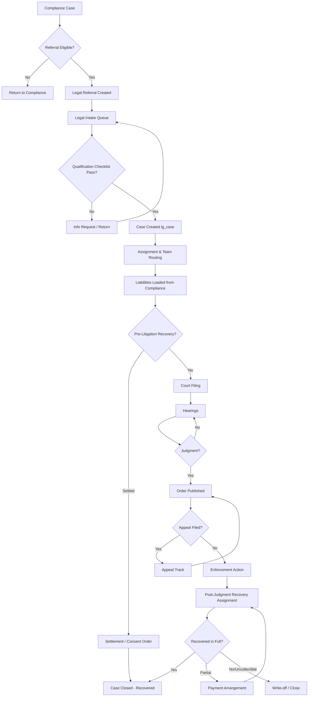

# Legal Platform — Business Process Map

**Version:** 1.0

---

## 1. End-to-End Flow

## 2. Decision Points
| # | Decision | Owner | Data |
|---|----------|-------|------|
| B | Referral eligibility | Compliance Lead | `ce_legal_referrals.status` |
| E | Intake qualification | Legal Officer | `lg_intake_checklist_response` |
| I | Pre-litigation resolution | Legal Officer | `lg_settlement`, `lg_consent_order` |
| L | Judgment obtained | Court + Legal Officer | `lg_order` |
| N | Appeal filed | External Party | `lg_appeal` |
| Q | Recovery outcome | Recovery Officer | `v_lg_case_financials.total_outstanding` |

## 3. Stage Transitions
Managed by `lg_workflow_policy` + `lg_stage_transition_rule`. Actions gated by `lg_stage_action_rule`; required documents by `lg_stage_document_rule`.
