# Legal Platform — Entity Relationship Diagram (ERD)

**Version:** 1.0  
**Scope:** EPIC-02 → EPIC-07 + ERP-01 + ERP-02  
**Status:** Production reference — no schema changes proposed.

---

## 1. Overview

The Legal Platform ERD documents every production entity across Intake, Matter Workspace, Court Operations, Judicial Orders, Appeals, Enforcement, Recovery Assignments and Post-Judgment recovery. Reference/master tables (`tb_*`, `core_*`) and shared enterprise tables (`ce_*`, `au_er_master`, `au_ip_master`) are shown where they are consumed by Legal.

Naming conventions:
- `lg_*` — Legal domain (owned by Legal)
- `la_*` — Legal Advisory (advisory, contract review, matter-lite)
- `ce_*` — Compliance Enforcement (upstream referral source)
- `core_*` — Enterprise shared (documents, templates, legal references, orgs)
- `tb_*` — Reference/master lookups
- `au_*` — Master registries (employer, IP)
- `v_*` — Views

---

## 2. Complete ERD (Mermaid)

```mermaid
erDiagram
  au_er_master ||--o{ lg_case_intake : "employer subject"
  au_ip_master ||--o{ lg_case_intake : "ip subject"
  ce_legal_referrals ||--o{ lg_case_intake : "compliance referral"
  ce_cases ||--o{ ce_legal_referrals : "source case"

  lg_case_intake ||--|| lg_case : "qualifies into"
  lg_case_intake_source ||--o{ lg_case_intake : "source config"
  lg_intake_checklist_template ||--o{ lg_intake_checklist_response : "template"
  lg_case_intake ||--o{ lg_intake_checklist_response : "checklist"
  lg_case_intake ||--o{ lg_intake_info_request : "info requests"
  lg_case_intake ||--o{ lg_intake_decision_audit : "audit"

  lg_case ||--o{ lg_case_party : "parties"
  lg_case ||--o{ lg_case_note : "notes"
  lg_case ||--o{ lg_case_activity : "activity"
  lg_case ||--o{ lg_case_task : "tasks"
  lg_case ||--o{ lg_case_deadline : "deadlines"
  lg_case ||--o{ lg_case_calendar_event : "calendar"
  lg_case ||--o{ lg_case_assignment : "assignment"
  lg_case_assignment ||--o{ lg_case_assignment_history : "history"
  lg_case ||--o{ lg_case_stage_history : "stage history"
  lg_case ||--o{ lg_case_referral : "outbound referrals"
  lg_case_action_catalog ||--o{ lg_case_action : "action def"
  lg_case ||--o{ lg_case_action : "actions"
  lg_matter_type ||--o{ lg_case : "matter type"

  lg_case ||--o{ lg_recoverable_liability : "liabilities"
  lg_recoverable_liability ||--o{ lg_liability_audit : "audit"
  lg_recoverable_liability ||--o{ lg_liability_note : "notes"
  lg_recoverable_liability ||--o{ lg_order_liability : "on orders"
  lg_recoverable_liability ||--o{ lg_appeal_liability : "on appeals"
  lg_recoverable_liability ||--o{ lg_enforcement_liability : "on enforcement"
  lg_recoverable_liability ||--o{ lg_settlement_liability : "on settlement"
  lg_recoverable_liability ||--o{ lg_consent_liability : "on consent"
  lg_recoverable_liability ||--o{ lg_hearing_liability : "on hearing"
  lg_recoverable_liability ||--o{ lg_filing_liability : "on filing"
  lg_recoverable_liability ||--o{ lg_task_liability : "on tasks"
  lg_recoverable_liability ||--o{ lg_document_liability : "on documents"
  lg_recoverable_liability ||--o{ lg_cost_liability : "on cost"
  lg_recoverable_liability ||--o{ lg_arrangement_liability : "arrangement"
  lg_recoverable_liability ||--o{ lg_recovery_assignment_liability : "recovery"

  lg_court ||--o{ lg_court_division : "divisions"
  lg_court ||--o{ lg_court_venue : "venues"
  lg_court ||--o{ lg_court_officer : "officers"
  lg_court ||--o{ lg_court_filing : "filings"
  lg_case ||--o{ lg_court_filing : "case filings"
  lg_court_filing ||--o{ lg_court_filing_audit : "audit"
  lg_court ||--o{ lg_court_proceeding : "proceedings"
  lg_case ||--o{ lg_court_proceeding : "proceedings"

  lg_case ||--o{ lg_hearing : "hearings"
  lg_court ||--o{ lg_hearing : "at court"
  lg_hearing ||--o{ lg_hearing_attendee : "attendees"
  lg_hearing ||--o{ lg_hearing_adjournment : "adjournments"
  lg_hearing ||--o{ lg_hearing_communication : "comms"
  lg_hearing ||--o{ lg_hearing_evidence : "evidence"
  lg_hearing ||--o{ lg_hearing_prep_checklist : "prep"

  lg_case ||--o{ lg_order : "orders"
  lg_order ||--o{ lg_order_compliance_event : "compliance events"
  lg_case ||--o{ lg_judgment_compliance : "judgment compliance"
  lg_judgment_compliance ||--o{ lg_judgment_compliance_audit : "audit"

  lg_case ||--o{ lg_appeal : "appeals"
  lg_case ||--o{ lg_enforcement_action : "enforcement"
  lg_case ||--o{ lg_notice : "notices"

  lg_case ||--o{ lg_settlement : "settlements"
  lg_case ||--o{ lg_consent_order : "consent"
  lg_consent_order ||--o{ lg_consent_installment : "installments"
  lg_consent_order ||--o{ lg_consent_variation : "variations"
  lg_consent_order ||--o{ lg_consent_order_audit : "audit"

  lg_fee_rule ||--o{ lg_fee_charge : "charges"
  lg_fee_bundle ||--o{ lg_fee_bundle_item : "items"
  lg_fee_waiver_policy ||--o{ lg_fee_waiver_policy_tier : "tiers"
  lg_fee_waiver_policy ||--o{ lg_fee_waiver : "waivers"
  lg_case ||--o{ lg_fee_charge : "case fees"
  lg_case ||--o{ lg_legal_cost : "legal cost"
  lg_legal_cost ||--o{ lg_legal_cost_audit : "audit"

  lg_case ||--o{ lg_payment_allocation : "allocations"
  lg_recoverable_liability ||--o{ lg_payment_allocation : "liability alloc"
  lg_case ||--o{ lg_payment_arrangement_link : "arrangement"

  lg_case ||--o{ lg_recovery_assignment : "recovery assignment"
  lg_recovery_assignment ||--o{ lg_recovery_assignment_action : "actions"
  lg_recovery_assignment ||--o{ lg_recovery_assignment_audit : "audit"
  lg_recovery_assignment ||--o{ lg_recovery_assignment_history : "history"
  lg_recovery_assignment ||--o{ lg_recovery_assignment_transfer : "transfers"
  lg_recovery_campaign ||--o{ lg_recovery_assignment : "campaign"
  lg_recovery_campaign_type ||--o{ lg_recovery_campaign : "type"
  lg_recovery_strategy_type ||--o{ lg_recovery_assignment : "strategy"
  lg_recovery_workload_rule ||--o{ lg_recovery_assignment : "workload"

  lg_external_counsel ||--o{ lg_external_counsel_engagement : "engagements"
  lg_external_counsel_engagement ||--o{ lg_external_counsel_invoice : "invoices"
  lg_case ||--o{ lg_external_counsel_engagement : "engaged on"

  lg_case ||--o{ lg_document_link : "documents"
  core_generated_document ||--o{ lg_document_link : "generated doc"
  lg_document_template_registry ||--o{ core_template : "template"

  lg_team ||--o{ lg_team_member : "members"
  lg_team ||--o{ lg_team_workbasket : "baskets"
  lg_staff ||--o{ lg_team_member : "staff"
  lg_workbasket_role ||--o{ lg_team_workbasket : "role"

  lg_routing_policy ||--o{ lg_routing_case_type : "case type"
  lg_routing_policy ||--o{ lg_routing_precedence : "precedence"
  lg_routing_policy ||--o{ lg_routing_source_map : "source map"
  lg_routing_policy ||--o{ lg_routing_stage_override : "stage override"

  lg_workflow_policy ||--o{ lg_stage_transition_rule : "transitions"
  lg_workflow_policy ||--o{ lg_stage_action_rule : "actions"
  lg_workflow_policy ||--o{ lg_stage_document_rule : "documents"
  lg_workflow_policy ||--o{ lg_stage_template_mapping : "templates"
  lg_workflow_policy ||--o{ lg_stage_reference_mapping : "references"

  lg_sla_policy ||--o{ lg_case : "sla policy"
  lg_notification_rule ||--o{ lg_case_activity : "notification"

  la_matter ||--o{ la_matter_action : "actions"
  la_matter ||--o{ la_matter_activity : "activity"
  la_matter ||--o{ la_matter_document : "documents"
  la_matter ||--o{ la_matter_party : "parties"
  la_matter ||--o{ la_matter_assignment : "assignment"
  la_matter ||--o{ la_matter_referral : "referrals"
  la_matter_type ||--o{ la_matter : "type"
  la_advice_request ||--o{ la_assignment : "assignment"
  la_contract_review ||--o{ la_document_review_version : "versions"
  la_document_review_version ||--o{ la_document_review_comment : "comments"

  v_lg_case_financials }|..|| lg_case : "aggregates"
  v_lg_case_financials }|..|| lg_recoverable_liability : "sources"
```

---

## 3. Keys & Indexes (Post ERP-01)

| Table | Index | Purpose |
|-------|-------|---------|
| `lg_recoverable_liability` | `ix_lg_liab_employer_legal_status (employer_id, legal_status)` | Employer-scoped liability rollups |
| `lg_case_activity` | `ix_lg_case_activity_entity (entity_type, entity_id)` | Polymorphic activity lookups |
| `lg_recovery_assignment` | `ix_lg_recovery_assignment_officer_status (assigned_officer_id, status)` | Officer workbench queries |

All PKs are `id uuid` unless otherwise stated. All timestamps are `created_at` / `updated_at` with triggers.

---

## 4. Views

- `public.v_lg_case_financials` — deterministic case-level financial rollup from `lg_recoverable_liability` (single source). Columns: liability counts, `total_assessed`, `total_paid`, `total_outstanding`, `total_written_off`, currency, `last_liability_update`. See `LEGAL_FINANCIAL_ARCHITECTURE_VALIDATION.md §8`.

---

## 5. Cardinality Summary

- **1:1** — `lg_case_intake` ↔ `lg_case` (on qualification), `lg_case_assignment` (current) ↔ `lg_case`
- **1:N** — `lg_case` → liabilities, hearings, orders, appeals, enforcement, tasks, notes, documents, activity
- **N:M (junctions)** — `lg_*_liability` bridges (order/appeal/hearing/task/settlement/consent/document/enforcement/cost/arrangement/recovery)
- **Reference** — `lg_matter_type`, `tb_legal_status`, `lg_court`, `lg_court_officer`, `lg_fee_rule`, `core_legal_reference`
