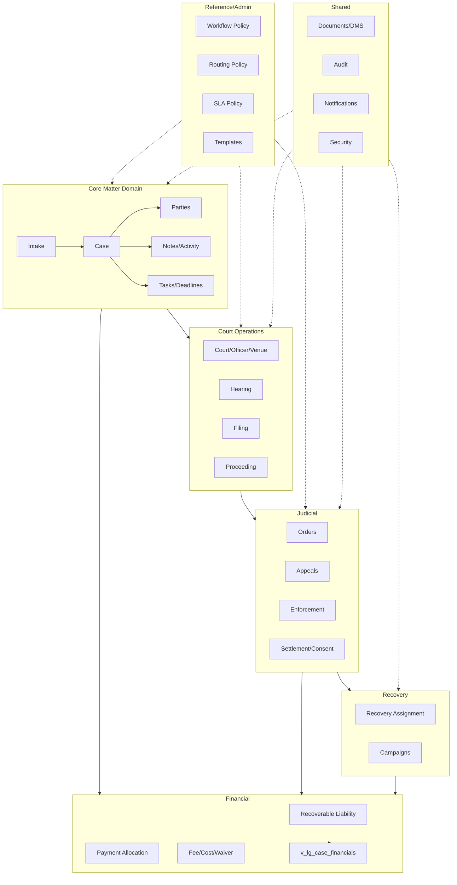
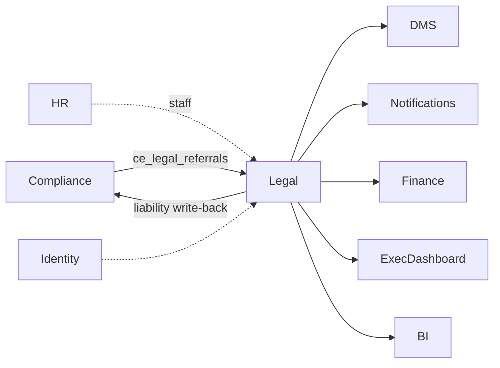
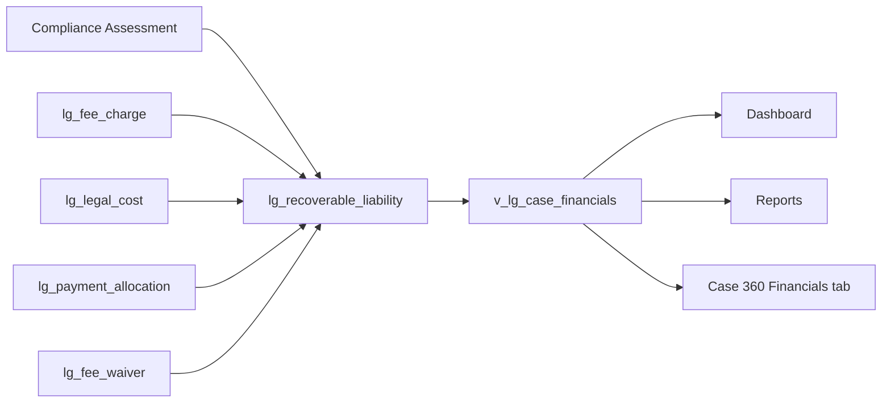
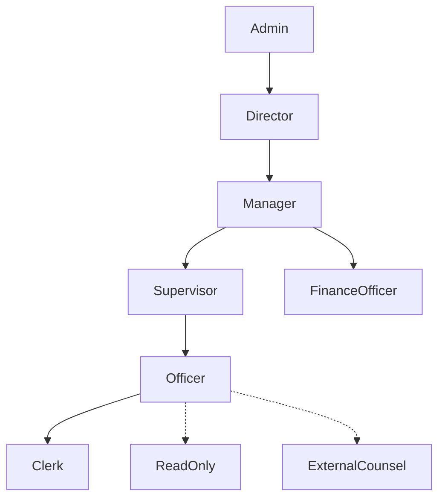
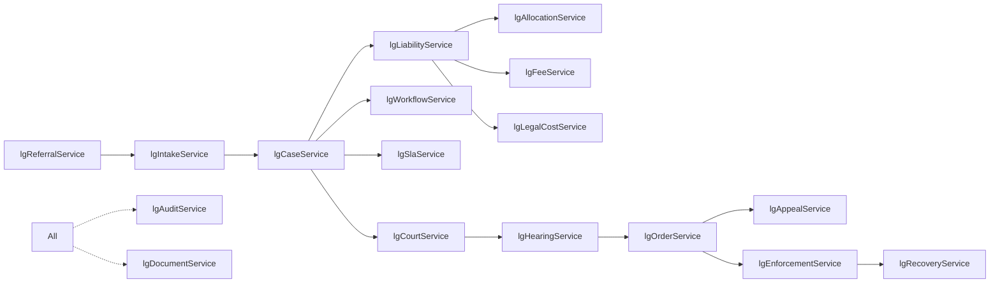
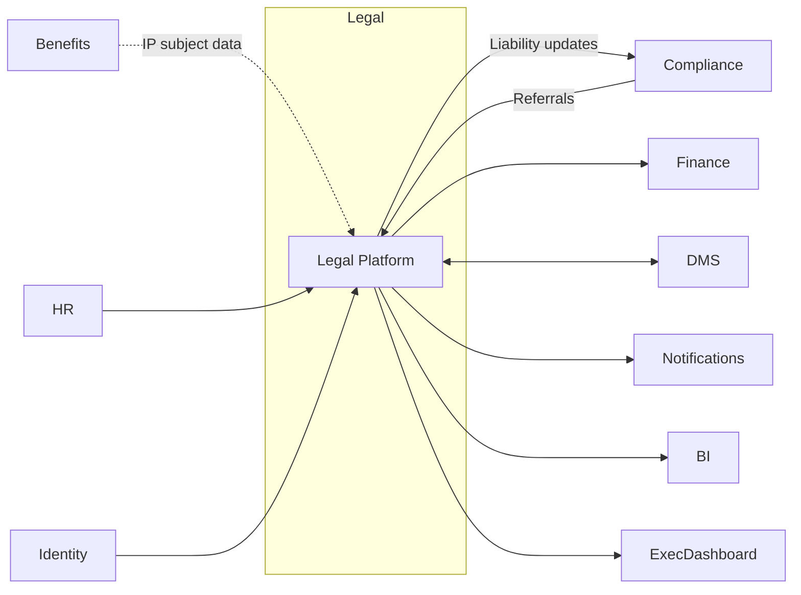

# Legal Platform — Master Architecture Document

**Version:** 1.0  
**Status:** V1 Certified — see `LEGAL_V1_CERTIFICATION_REPORT.md` (9.4/10).  
**Scope:** Single source of truth linking all Legal architecture artefacts.

---

## 1. Index of Deliverables

| # | Document | Purpose |
|---|----------|---------|
| 1 | `LEGAL_ENTITY_RELATIONSHIP_DIAGRAM.md` | Full ERD + cardinality + indexes |
| 2 | `LEGAL_BUSINESS_CAPABILITY_MAP.md` | Hierarchical capability catalog |
| 3 | `LEGAL_BUSINESS_PROCESS_MAP.md` | End-to-end lifecycle |
| 4 | `LEGAL_DATA_OWNERSHIP_MATRIX.md` | Owner/master/consumer per entity |
| 5 | `LEGAL_SERVICE_OWNERSHIP_MATRIX.md` | Service catalog + business rule ownership |
| 6 | `LEGAL_SCREEN_ARCHITECTURE.md` | Route → service → table map |
| 7 | `LEGAL_REFERENCE_ARCHITECTURE.md` | Reference/master data |
| 8 | `LEGAL_SECURITY_ARCHITECTURE.md` | Roles, capabilities, guards |
| 9 | `LEGAL_PRODUCT_REUSE_ANALYSIS.md` | Cross-agency productisation |
| 10 | `LEGAL_FINANCIAL_ARCHITECTURE_VALIDATION.md` | Single-source financial architecture + `v_lg_case_financials` |
| 11 | `LEGAL_RELATIONSHIP_AUDIT.md` | Orphan / cycle audit |
| 12 | `LEGAL_SCREEN_CERTIFICATION.md` | Screen-level certification |
| 13 | `LEGAL_PRODUCTION_CHECKLIST.md` | Go-live gates |
| 14 | `LEGAL_ENTERPRISE_READINESS_REPORT.md` | ERP-01 scorecard |
| 15 | `ERP02_*` | Role journeys, usability, business rule matrix, V2 backlog |
| 16 | `LEGAL_V1_CERTIFICATION_REPORT.md` | Final V1 certification |

---

## 2. Domain Architecture

---

## 3. Module Dependencies

---

## 4. Financial Data Flow

Single-source guarantee: no other table computes case financials.

---

## 5. Security Role Hierarchy

---

## 6. Service Dependency Diagram

---

## 7. Navigation Hierarchy

See `LEGAL_SCREEN_ARCHITECTURE.md §3`.

---

## 8. Integration Architecture

---

## 9. Non-Functional

- **Performance:** post-ERP-01 composite indexes; pagination via `.range()`; 1k-row chunked processing.
- **Auditability:** every domain has `*_audit` tables; overrides logged in `legal_admin_audit`.
- **Security:** No-RLS, role-based, capability-gated routes, workflow guards.
- **Financial integrity:** deterministic single source via `v_lg_case_financials`.
- **Extensibility:** policy-driven (workflow, routing, SLA, fees, waivers, templates).

---

## 10. Change Management

Any new capability MUST:
1. Update ERD + Capability Map + Screen Architecture.
2. Register service in `LEGAL_SERVICE_OWNERSHIP_MATRIX.md`.
3. Add business rules to `ERP02_BUSINESS_RULE_MATRIX.md`.
4. Extend `LEGAL_PRODUCTION_CHECKLIST.md` if go-live impacted.
5. Re-run typecheck (`tsgo --noEmit`).
