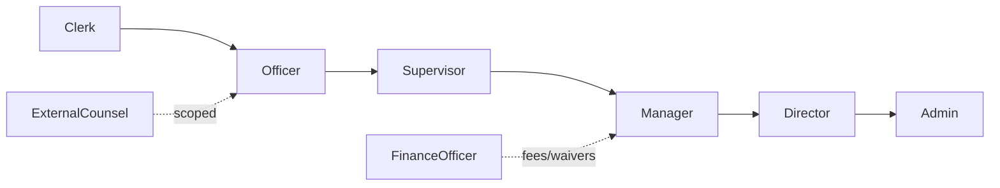

# Legal Platform — Security Architecture

**Version:** 1.0  
**Architectural rule:** No RLS. Authorization is enforced at the application/edge layer per `docs/ARCHITECTURE-NO-RLS-RULE.md`.

---

## 1. Roles

| Role | Description |
|------|-------------|
| `LEGAL_READ_ONLY` | View-only across operational screens |
| `LEGAL_CLERK` | Create intake, capture data |
| `LEGAL_OFFICER` | Full case operations |
| `LEGAL_SUPERVISOR` | Assign, publish orders, override |
| `LEGAL_FINANCE_OFFICER` | Fee, waiver, allocation approval |
| `LEGAL_MANAGER` | Team routing, SLA, admin |
| `LEGAL_DIRECTOR` | Policy, workflow, reference data |
| `LEGAL_ADMIN` | Full admin surface |
| `EXTERNAL_COUNSEL` | Scoped access via `lg_external_counsel_engagement` |

## 2. Capabilities (`LegalCapability`)

`isLegal`, `view`, `canViewWorkbench`, `canAssignCase`, `canPublishOrder`, `canManageTemplates`, `canManageRouting`, `canManageReferenceData`, `canManageSla`, `canRunIntegrityChecks`, `canFinanceReconcile`, `canOverride`.

## 3. Route Guards

- `LegalRouteGuard` uses `getRequiredLegalCap(pathname)` from `src/config/legalRouteCapabilities.ts`.
- Longest-prefix match; admin routes require specific capabilities; operational routes require `view` or category cap.

## 4. Workflow Guards

- `lg_stage_transition_rule` — allowed next stages.
- `lg_stage_action_rule` — action → role mapping.
- `lg_stage_document_rule` — required documents to transition.
- Server-side enforcement in each service before write.

## 5. Approval Hierarchy

## 6. Admin Override

`legal_admin_audit` records every override (actor, target, reason, before/after). Enforced by `lgAuditService`.

## 7. PII

Governed by `PIIMaskingContext`. Officer-level unlock logged in `pii_unlock_logs`.
